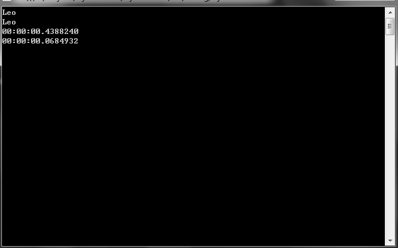

# C#中dynamic的正确用法

dynamic是FrameWork4.0的新特性。dynamic的出现让C#具有了弱语言类型的特性。编译器在编译的时候不再对类型进行检查，编译期默认dynamic对象支持你想要的任何特性。比如，即使你对GetDynamicObject方法返回的对象一无所知，你也可以像如下那样进行代码的调用，编译器不会报错：

```c#
dynamic dynamicObject = GetDynamicObject();
Console.WriteLine(dynamicObject.Name);
Console.WriteLine(dynamicObject.SampleMethod());
```
dynamic 类型与 object 的不同之处在于，编译器不会对包含类型 dynamic 的表达式的操作进行解析或类型检查。 编译器将有关该操作信息打包在一起，之后这些信息会用于在运行时评估操作。 在此过程中，dynamic 类型的变量会编译为 object 类型的变量。 因此，dynamic 类型只在编译时存在，在运行时则不存在。

---

常有人会拿var这个关键字来和dynamic做比较。实际上，var和dynamic完全是两个概念，根本不应该放在一起做比较。var实际上是编译期抛给我们的“语法糖”，一旦被编译，编译期会自动匹配var 变量的实际类型，并用实际类型来替换该变量的申明，这看上去就好像我们在编码的时候是用实际类型进行申明的。而dynamic被编译后，实际是一个object类型，只不过编译器会对dynamic类型进行特殊处理，让它在编译期间不进行任何的类型检查，而是将类型检查放到了运行期。

这从visual studio的编辑器窗口就能看出来。以var声明的变量，支持“智能感知”，因为visual studion能推断出var类型的实际类型，而以dynamic声明的变量却不支持“智能感知”，因为编译器对其运行期的类型一无所知。对dynamic变量使用“智能感知”，会提示“此操作将在运行时解析”。

关于dynamic变量是一个object变量这一点，可以通过IL代码得到验证，这里不再贴出IL代码。当然，编译器也对dynamic声明进行了处理，以区别直接object变量。

dynamic是做为简化互操作性而被MSDN中大肆渲染，我感觉正是基于这一点，才被部分开发人员误解：因为很多开发人员不会接触COM+、OFFICE二次开发之类的编码，所以急需要一个dynamic的应用理由。那么，在日常开发中，我认为dynamic很有价值的一点是：

**类型转换**

Dynamic类型的实例和其他类型的实例间的转换是很简单的，开发人员能够很方便地在dyanmic和非dynamic行为间切换。任何实例都能隐式转换为dynamic类型实例，见下面的例子：

```c#
dynamic d1 = 7;
dynamic d2 = "a string";
dynamic d3 = System.DateTime.Today;
dynamic d4 = System.Diagnostics.Process.GetProcesses();
```

Conversely, an implicit conversion can be dynamically applied to any expression of type dynamic.

反之亦然，类型为dynamic的任何表达式也能够隐式转换为其他类型。（英文的翻译）

```c#
int i = d1;
string str = d2;
DateTime dt = d3;
System.Diagnostics.Process[] procs = d4;
```

**方法中含有dynamic类型参数的重载问题**

如果调用一个方法是传递了dynamic类型的对象，或者被调用的对象是dynamic类型的，那么重载的判断是发生在运行时而不是编译时。

-----------

**动态语言运行时（dynamic language runtime DLR）**

动态语言运行时是.NET Framework 4 Beta 1中的一组新的API，它提供了对c#中dynamic类型的支持，也实现了像IronPython和IronRuby之类的动态程序设计语言。

-----

**dynamic可以简化反射**。

以前我们这样使用反射：

```c#
public class DynamicSample
{
public string Name { get; set; }

public int Add(int a, int b)
{
return a + b;
}
}
DynamicSample dynamicSample = new DynamicSample(); //create instance为了简化演示，我没有使用反射
var addMethod = typeof(DynamicSample).GetMethod("Add");
int re = (int)addMethod.Invoke(dynamicSample, new object[] { 1, 2 });
```

现在，我们有了简化的写法：

```c#
dynamic dynamicSample2 = new DynamicSample();
int re2 = dynamicSample2.Add(1, 2);
```

我们可能会对这样的简化不以为然，毕竟看起来代码并没有减少多少，但是，如果考虑到效率兼优美两个特性，那么dynamic的优势就显现出来了。编译器对dynamic进行了优化，比没有经过缓存的反射效率快了很多。如果非要比较，可以将上面两者的代码（调用Add方法部分）运行1000000就可以得出结论。

-----

### 用法举例

1. 替代XXX.GetType().GetProperty("YYY").GetValue(XXX)

   > ```c#
   > static object GetPerson()
   > {
   >     return new Person { Name = "Leo" };
   > } 
   > ```
   >
   > 有时候难免会遇到这种返回object的倒霉代码（特别是跟反射有关的时候），这时我们又要访问其中的某个属性，那个费劲啊，现在有了dynamic感觉好多了。
   >
   > ```c#
   > object objPerson = GetPerson();
   > var objName =  objPerson.GetType().GetProperty("Name").GetValue(objPerson);
   > Console.WriteLine(objName);
   > 
   > dynamic dynPerson = GetPerson();
   > var dynName = dynPerson.Name;
   > Console.WriteLine(dynName);
   > ```
   >
   > 另一个好处是性能会得到一程度的提升：
   >
   > ```c#
   > Watch = new Stopwatch();
   >             Watch.Start();
   >             for (int i = 0; i < 1000000; i++)
   >             {
   >                 objName = objPerson.GetType().GetProperty("Name").GetValue(objPerson);
   >             }
   >             Watch.Stop();
   >             Console.WriteLine(Watch.Elapsed);
   > 
   > 
   >             Watch.Restart();
   >             for (int i = 0; i < 1000000; i++)
   >             {
   >                 dynName = dynPerson.Name;
   >             }
   >             Watch.Stop();
   >             Console.WriteLine(Watch.Elapsed);
   > ```
   >
   > 大致结果如下图，还是快了很多的：
   >
   > 
   
2. 拯救接手接口没设计好的代码的倒霉孩子

   >比如这里有N个WCF服务，返回了N个对象的集合，这几个对象没啥关系，其实又有一点关系，倒霉孩子又不会让Entity Framework生成的类自动继承某个接口（本文里用本地方法代替WCF服务）。
   >
   >​    这里来举一个例子，首先有下面2个倒霉的类，同样string类型的name是可以提取接口的（这里真的合适提取么……），同样名称但不同类型的ID，完全无关的Age和Price。
   >
   >```c#
   >public class Person
   >    {
   >        public int ID { get; set; }
   >
   >        public string Name { get; set; }
   >
   >        public int Age { get; set; }
   >
   >        public static List<Person> GetPersonList()
   >        {
   >            return new List<Person>
   >            {
   >                new Person{ Name = "Leo1" , Age = 10 },
   >                new Person{ Name = "Leo2" , Age = 20 },
   >                new Person{ Name = "Leo3" , Age= 30 }
   >            };
   >        }
   >    }
   >
   >    public class Car
   >    {
   >        public Guid ID { get; set; }
   >
   >        public string Name { get; set; }
   >
   >        public double Price { get; set; }
   >
   >        public static List<Car> GetCarList()
   >        {
   >            return new List<Car>
   >            {
   >                new Car{ Name = "Focus1" , Price = 100 },
   >                new Car{ Name = "Focus2" , Price = 200 },
   >                new Car{ Name = "Focus3" , Price = 300 }
   >            };
   >        }
   >    }
   >```
   >
   > 我用2个static方法返回不同类型的List<T>来模拟WCF中最普通的调用。
   >
   >```c#
   >static void Main(string[] args)
   >        {
   >            List<dynamic> list = new List<dynamic>();
   >            //用本地方法替代WCF服务，您假装是通过WCF获取的list
   >            Person.GetPersonList().ForEach((p) => list.Add(p));
   >            TestDynamic2(list,"Leo2");
   >
   >            list = new List<dynamic>();
   >            //用本地方法替代WCF服务，您假装是通过WCF获取的list
   >            Car.GetCarList().ForEach((c) => list.Add(c));
   >            TestDynamic2(list,"Focus3");
   >
   >            Console.ReadKey();
   >        }
   >
   >        private static void TestDynamic2(List<dynamic> list,string name)
   >        {
   >            //可以无差别的使用ID和Name属性
   >            dynamic first = list.OrderBy(d => d.ID).FirstOrDefault(d => d.Name.Contains(name));
   >
   >            //差别对待不同的属性，这里供参考，不建议这么写，这会导致依赖具体的类型
   >            if (first is Person)
   >            {
   >                Console.WriteLine(first.Age);
   >            }
   >            else
   >            {
   >                Console.WriteLine(first.Price);
   >            }
   >        }
   >```
   >
   >

