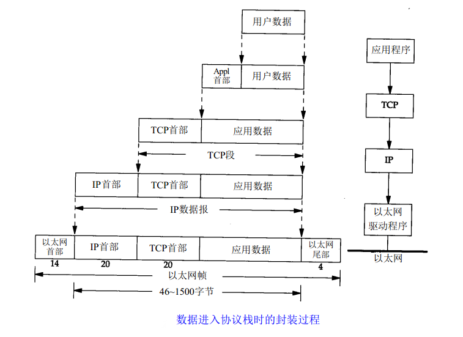
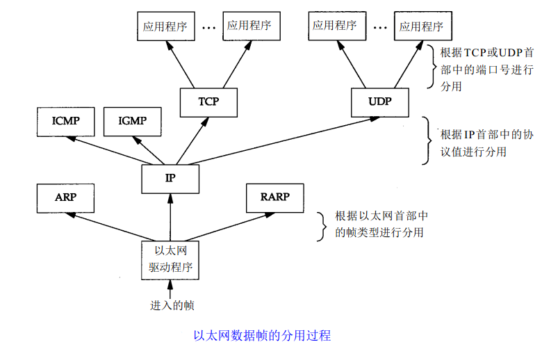
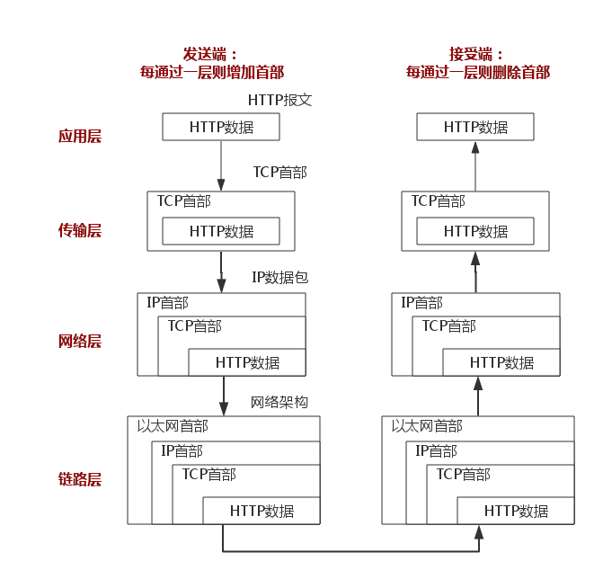
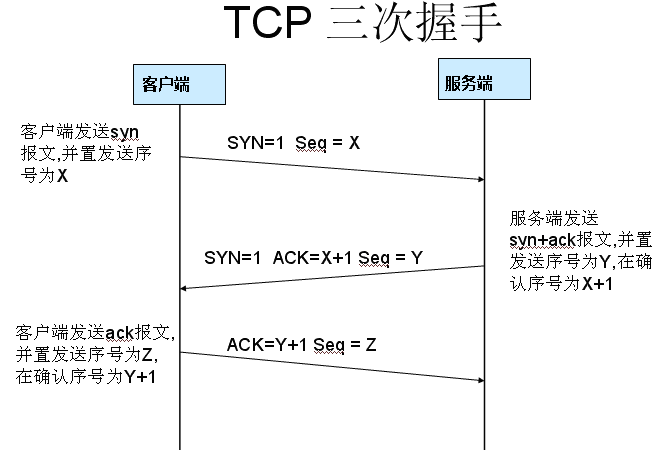
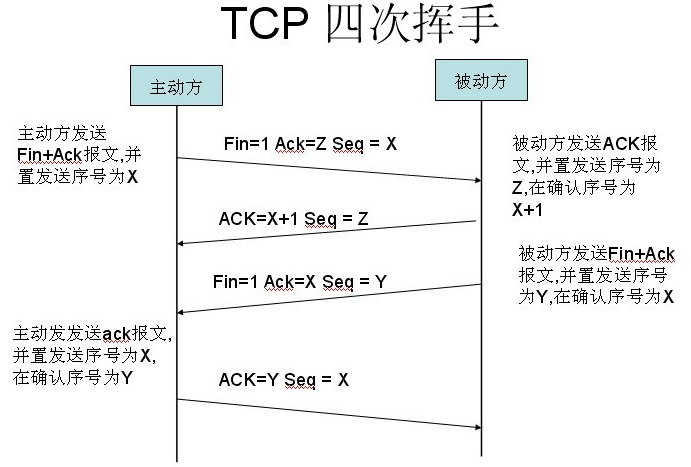

# http请求与响应，TCP三次握手&四次分手

### 一、HTTP是什么

​    http（HyperText Transfer Protocol），超文本传输协议，是互联网上应用最广泛的一种网络协议，所有www文件都必须遵守的一个标准，是以 ASCII 码传输，建立在 TCP/IP 协议之上的应用层规范。说白了，就是大家都约好互相之间按照一种固定的规则来进行通讯。

​    http也可以说成是一种客户端和应答服务器端请求和应答的标准（TCP）。通过使用浏览器或其他工具（如google的Postman），客户端发起一个到应答服务器上指定端口（如Tomcat的8080或jmx的1099等）的http请求，或者反过来，服务器给客户端发送一个回应。在客户端和应答服务器端可能存在多个中间层，比如代理、网关或者隧道。

### 二、HTTP请求报文

​    http请求报文是指客户端到服务器端的消息，客户端通过发送http请求向服务器请求对资源的访问。包括三个部分：请求行、请求头部、请求数据。请求方法有 OPTIONS、GET、HEAD、POST、PUT、DELETE、TRACE、CONNECT 这几种。

> 1. 请求行：包含请求方法、uri和协议的版本，用空格分隔，例如：GET/sample.jsp HTTP/1.1
> 2. 请求头部：包含有关客户端环境及请求正文的信息，如请求正文长度、浏览器所用编码格式等，例如: 
>
> ```http
> Accept:image/gif.image/jpeg.*/*
> 
> Accept-Language:zh-cn
> 
> Connection:Keep-Alive
> 
> Host:localhost
> 
> User-Agent:Mozila/4.0(compatible:MSIE5.01:Windows NT5.0)
> 
> Accept-Encoding:gzip,deflate
> ```
>
> 3. 请求数据：即客户端发送给服务器的内容，可为空（GET请求就没有请求数据），例如：username=jinqiao&password=1234
>
> PS：
>
>     1. 请求头部和请求数据之间必须有空行，用以区分。
>        2. 最常用的请求头部是Content-Type（请求编码方式）和Content-Length（请求数据长度），例如：
>
> ```http
> Content-Type: application/x-www-form-urlencoded 
> 
> Content-Length: 35 
> ```
>
> 

### 三、HTTP应答报文

​    http应答报文是指服务器回应http请求，发送给客户端的消息。也包括三个部分：状态行、响应头部、响应数据。

  1 状态行：协议版本、状态码、简要描述，例如：HTTP/1.1 200 OK

  2 响应头部：必须指明Content-Type，其他可选，例如：Content-Type: text/plain

  3 响应数据：即服务器回应客户端的内容。

PS：常见状态码

1xx：指示信息--表示请求已接收，继续处理。
2xx：成功--表示请求已被成功接收、理解、接受。
3xx：重定向--要完成请求必须进行更进一步的操作。
4xx：客户端错误--请求有语法错误或请求无法实现。
5xx：服务器端错误--服务器未能实现合法的请求。

### 四、HTTP请求与响应步骤

http请求和响应，说白了就是计算机之间的问答对话。http请求是提问者，http响应是回答者。详细步骤如下图所示。

**1 建立连接**

​    先解析DNS，把localhost变成ip（127.0.0.1），然后根据127.0.0.1和端口号8080（没有端口号则使用默认的端口）建立socket。也可以理解为通过“三次握手”建立TCP连接，确定通讯正常。

  **2** **发送请求命令**

​    socket建立好之后，客户端开始向web服务器发送请求命令（GET/POST等）。

  **3** **发送请求头**（和请求正文如果有）

​    客户端先发送与自身相关的信息，再发送空行表示请求头发送完毕，如果是post则继续发送请求正文。

  **4 回传状态行**

​    应答第一步，发送协议版本和状态码（200、503、404等）

  **5 回传应答头**

​    应答第二步，先发送自身相关信息、Content-Type(必须)及被请求的文档，在发送空行宝石应答头发送完毕。

  **6 回传应答正文**

​    应答第三步，根据应答头的Content-Type指定的格式发送应答正文。

  **7 关闭连接**

​    一次‘会话’完成，如果设置了Connection：keep-alive则TCP连接不关闭，否则关闭连接。

### 五、TCP/IP协议

TCP/IP协议模型（Transmission Control Protocol/Internet Protocol），包含了一系列构成互联网基础的网络协议，是Internet的核心协议，通过20多年的发展已日渐成熟，并被广泛应用于局域网和广域网中，目前已成为事实上的国际标准。TCP/IP协议簇是一组不同层次上的多个协议的组合，通常被认为是一个四层协议系统，与OSI的七层模型相对应。

HTTP协议就是基于TCP/IP协议模型来传输信息的。

**1 链路层**
    也称作数据链路层或网络接口层（在第一个图中为网络接口层和硬件层），通常包括操作系统中的设备驱动程序和计算机中对应的网络接口卡。它们一起处理与电缆（或其他任何传输媒介）的物理接口细节。ARP（地址解析协议）和RARP（逆地址解析协议）是某些网络接口（如以太网和令牌环网）使用的特殊协议，用来转换IP层和网络接口层使用的地址。

**2 网络层**
    也称作互联网层（在第一个图中为网际层），处理分组在网络中的活动，例如分组的选路。在TCP/IP协议族中，网络层协议包括IP协议（网际协议），ICMP协议（Internet互联网控制报文协议），以及IGMP协议（Internet组管理协议）。
   IP是一种网络层协议，提供的是一种不可靠的服务，它只是尽可能快地把分组从源结点送到目的结点，但是并不提供任何可靠性保证。同时被TCP和UDP使用。TCP和UDP的每组数据都通过端系统和每个中间路由器中的IP层在互联网中进行传输。
   ICMP是IP协议的附属协议。IP层用它来与其他主机或路由器交换错误报文和其他重要信息。IGMP是Internet组管理协议。它用来把一个UDP数据报多播到多个主机。

**3 传输层**
   主要为两台主机上的应用程序提供端到端的通信。在TCP/IP协议族中，有两个互不相同的传输协议：TCP（传输控制协议）和UDP（用户数据报协议）。
   TCP为两台主机提供高可靠性的数据通信。它所做的工作包括把应用程序交给它的数据分成合适的小块交给下面的网络层，确认接收到的分组，设置发送最后确认分组的超时时钟等。由于运输层提供了高可靠性的端到端的通信，因此应用层可以忽略所有这些细节。为了提供可靠的服务，TCP采用了超时重传、发送和接收端到端的确认分组等机制。
   UDP则为应用层提供一种非常简单的服务。它只是把称作数据报的分组从一台主机发送到另一台主机，但并不保证该数据报能到达另一端。一个数据报是指从发送方传输到接收方的一个信息单元（例如，发送方指定的一定字节数的信息）。UDP协议任何必需的可靠性必须由应用层来提供。


**4  应用层**
   应用层决定了向用户提供应用服务时通信的活动。TCP/IP 协议族内预存了各类通用的应用服务。包括 HTTP，FTP（File Transfer Protocol，文件传输协议），DNS（Domain Name System，域名系统）服务。

     当应用程序用TCP传送数据时，数据被送入协议栈中，然后逐个通过每一层直到被当作一串比特流送入网络。其中每一层对收到的数据都要增加一些首部信息（有时还要增加尾部信息），该过程如图所示。




​    当目的主机收到一个以太网数据帧时，数据就开始从协议栈中由底向上升，同时去掉各层协议加上的报文首部。每层协议盒都要去检查报文首部中的协议标识，以确定接收数据的上层协议。这个过程称作分用（Demultiplexing）。协议是通过目的端口号、源I P地址和源端口号进行解包的。

​    通过以上步骤我们从TCP/IP模型的角度来理解了一次HTTP请求与响应的过程。下面这张图更清楚明白：



### 六、TCP三次握手

​    

**第一次握手**

​    建立连接。客户端发送连接请求报文段，将SYN位置为1，Sequence Number为x；然后，客户端进入SYN_SEND状态，等待服务器的确认；

**第二次握手**

​    服务器收到SYN报文段。服务器收到客户端的SYN报文段，需要对这个SYN报文段进行确认，设置Acknowledgment Number为x+1(Sequence Number+1)；同时，自己自己还要发送SYN请求信息，将SYN位置为1，Sequence Number为y；服务器端将上述所有信息放到一个报文段（即SYN+ACK报文段）中，一并发送给客户端，此时服务器进入SYN_RECV状态；

**第三次握手**

​    客户端收到服务器的SYN+ACK报文段。然后将Acknowledgment Number设置为y+1，向服务器发送ACK报文段，这个报文段发送完毕以后，客户端和服务器端都进入ESTABLISHED状态，完成TCP三次握手。


**为什么要三次握手**

为了防止已失效的连接请求报文段突然又传送到了服务端，因而产生错误。


具体例子：“已失效的连接请求报文段”的产生在这样一种情况下：client发出的第一个连接请求报文段并没有丢失，而是在某个网络结点长时间的滞留了，以致延误到连接释放以后的某个时间才到达server。本来这是一个早已失效的报文段。但server收到此失效的连接请求报文段后，就误认为是client再次发出的一个新的连接请求。于是就向client发出确认报文段，同意建立连接。假设不采用“三次握手”，那么只要server发出确认，新的连接就建立了。由于现在client并没有发出建立连接的请求，因此不会理睬server的确认，也不会向server发送数据。但server却以为新的运输连接已经建立，并一直等待client发来数据。这样，server的很多资源就白白浪费掉了。采用“三次握手”的办法可以防止上述现象发生。例如刚才那种情况，client不会向server的确认发出确认。server由于收不到确认，就知道client并没有要求建立连接。”

### 七、四次挥手



**第一次分手**

​    主机1（可以使客户端，也可以是服务器端），设置Sequence Number，向主机2发送一个FIN报文段；此时，主机1进入FIN_WAIT_1状态；这表示主机1没有数据要发送给主机2了；

**第二次分手**

​    主机2收到了主机1发送的FIN报文段，向主机1回一个ACK报文段，Acknowledgment Number为Sequence Number加1；主机1进入FIN_WAIT_2状态；主机2告诉主机1，我“同意”你的关闭请求；

**第三次分手**

​    主机2向主机1发送FIN报文段，请求关闭连接，同时主机2进入LAST_ACK状态；

**第四次分手**

​    主机1收到主机2发送的FIN报文段，向主机2发送ACK报文段，然后主机1进入TIME_WAIT状态；主机2收到主机1的ACK报文段以后，就关闭连接；此时，主机1等待2MSL后依然没有收到回复，则证明Server端已正常关闭，那好，主机1也可以关闭连接了。


**为什么要四次分手**
    TCP协议是一种面向连接的、可靠的、基于字节流的运输层通信协议。TCP是全双工模式，这就意味着，当主机1发出FIN报文段时，只是表示主机1已经没有数据要发送了，主机1告诉主机2，它的数据已经全部发送完毕了；但是，这个时候主机1还是可以接受来自主机2的数据；当主机2返回ACK报文段时，表示它已经知道主机1没有数据发送了，但是主机2还是可以发送数据到主机1的；当主机2也发送了FIN报文段时，这个时候就表示主机2也没有数据要发送了，就会告诉主机1，我也没有数据要发送了，之后彼此就会愉快的中断这次TCP连接。