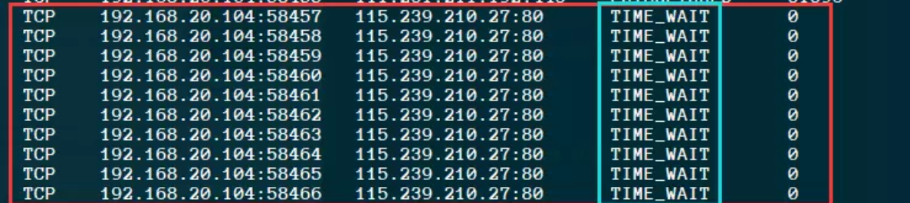
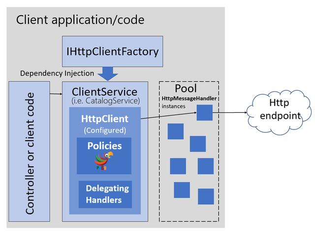

> .net core HttpClient 使用之掉坑解析（一）
>
> 2020年12月18日 11:20

# 一、前言

## 在我们开发当中经常需要向特定URL地址发送Http请求操作，在.net core 中对httpClient使用不当会造成灾难性的问题，这篇文章主要来分享.net core中通过IHttpClientFactory 工厂来使用HttpClient的正确打开方式。

> **二、HttpClient使用中的那些坑**

1.  **错误使用**

using(var client = new HttpClient())

## 我们可以先来做一个简单的测试，代码如下：

> public async Task\<string\> GetBaiduListAsync(string url)
>
> {
>
> var html = \"\";
>
> for (var i = 0; i \< 10; i++)
>
> {
>
> using (var client = new System.Net.Http.HttpClient())
>
> {
>
> var result=await client.GetStringAsync(url); html += result;
>
> }
>
> }
>
> return html;
>
> }

## 运行项目输出结果后，通过netstate查看下TCP连接情况：

</img>

> 虽然项目已经运行结束，但是连接依然存在，状态为\" TIME_WAIT\"（继续等待看是否还有延迟的包会传输过来；默认在windows下，TIME_WAIT状态将会使系统将会保持该连接 240s。
>
> 在高并发的情况下，连接来不及释放，socket被耗尽，耗尽之后就会出现喜闻乐见的一个错误：
>
> **错误原因:**

## 对象所占用资源应该确保及时被释放掉，但是，对于网络连接而言，这是错误的,原因有如下：

-   网络连接是需要耗费一定时间的，频繁开启与关闭连接，性能会受影响；

-   开启网络连接时会占用底层socket资源，但在HttpClient调用其本身的Dispose方法时，并不能立刻释放该资源，这意味着你的程序可能会因为耗尽连接资源而产生灾难性的问题。

> 对于上面的错误原因，大家可能会想到使用静态单例模式的HttpClient，如下：

private static HttpClient Client = new HttpClient();

## 静态单例模式虽然可以解决上面问题，但是会带来另外一个问题：

-   DNS变更会导致不能解析，DNS不会重新加载，需要重启才能变更（有兴趣的大佬可以去尝试一下）

> **三、正确使用及源码分析**

{width="5.0in" height="1.115in"}

> HttpClientFactory 以模块化、可命名、可配置、弹性方式重建了HttpClient 的使用方式： 由DI 框架注入IHttpClientFactory 工厂；由工厂创建HttpClient 并从内部的Handler 池分配请求Handler。
>
> .net core 2.1 开始引入了IHttpClientFactory 工厂类来自动管理IHttpClientFactory 类的创建和资源释放，可以通过Ioc 注入方式进行使用，代码如下：

services.AddControllers(); services.AddHttpClient();

## 调用代码如下：

private readonly IHttpClientFactory \_clientFactory; public FirstController(IHttpClientFactory clientFactory)

{

> \_clientFactory = clientFactory;

}

/// \<summary\>

///

/// \</summary\>

/// \<param name=\"url\"\>\</param\>

/// \<returns\>\</returns\>

public async Task\<string\> GetBaiduAsync(string url)

{

> var client = \_clientFactory.CreateClient(); var result = await client.GetStringAsync(url); return result;

}

> 代码中通过IHttpClientFactory 中的CreateClient()方法进行创建一个HttpClient 对象,但是没有看到有释放资源的动作，那它是怎么释放的呢？

## 我们来看看它的主要源代码

/// \<summary\>

/// Creates a new \<see cref=\"HttpClient\"/\> using the default configuration.

/// \</summary\>

/// \<param name=\"factory\"\>The \<see cref=\"IHttpClientFactory\"/\>.\</param\>

/// \<returns\>An \<see cref=\"HttpClient\"/\> configured using the default configuration.\</returns\>

public static HttpClient CreateClient(this IHttpClientFactory factory)

{

> if (factory == null)
>
> {
>
> throw new ArgumentNullException(nameof(factory));
>
> }

return factory.CreateClient(Options.DefaultName);

}

public HttpClient CreateClient(string name)

{

> if (name == null)
>
> {
>
> throw new ArgumentNullException(nameof(name));
>
> }

var handler = CreateHandler(name);

> var client = new HttpClient(handler, disposeHandler: false);

var options = \_optionsMonitor.Get(name);

> for (var i = 0; i \< options.HttpClientActions.Count; i++)
>
> {
>
> options.HttpClientActions\[i\](client);
>
> }

return client;

}

public HttpMessageHandler CreateHandler(string name)

{

> if (name == null)
>
> {
>
> throw new ArgumentNullException(nameof(name));
>
> }

var entry = \_activeHandlers.GetOrAdd(name, \_entryFactory).Value; StartHandlerEntryTimer(entry);

return entry.Handler;

}

> 代码中可以看到创建HttpClent 时会先创建HttpMessageHandler对象,而CreateHandler 方法中调用了StartHandlerEntryTimer方法，该方法主要时启动清理释放定时器方法，核心代码如下：
>
> public DefaultHttpClientFactory(
>
> IServiceProvider services, IServiceScopeFactory scopeFactory, ILoggerFactory loggerFactory,
>
> IOptionsMonitor\<HttpClientFactoryOptions\> optionsMonitor, IEnumerable\<IHttpMessageHandlerBuilderFilter\> filters)
>
> {
>
> if (services == null)
>
> {
>
> throw new ArgumentNullException(nameof(services));
>
> }
>
> if (scopeFactory == null)

{

> throw new ArgumentNullException(nameof(scopeFactory));
>
> }

if (loggerFactory == null)

> {
>
> throw new ArgumentNullException(nameof(loggerFactory));
>
> }

if (optionsMonitor == null)

> {
>
> throw new ArgumentNullException(nameof(optionsMonitor));
>
> }

if (filters == null)

> {
>
> throw new ArgumentNullException(nameof(filters));
>
> }

\_services = services;

> \_scopeFactory = scopeFactory;
>
> \_optionsMonitor = optionsMonitor;
>
> \_filters = filters.ToArray();

\_logger = loggerFactory.CreateLogger\<DefaultHttpClientFactory\>();

// case-sensitive because named options is.

\_activeHandlers = new ConcurrentDictionary\<string, Lazy\<ActiveHandlerTrackingEntry\>\>(StringComparer.Ordinal);

> \_entryFactory = (name) =\>
>
> {
>
> return new Lazy\<ActiveHandlerTrackingEntry\>(() =\>
>
> {
>
> return CreateHandlerEntry(name);
>
> }, LazyThreadSafetyMode.ExecutionAndPublication);
>
> };

\_expiredHandlers = new ConcurrentQueue\<ExpiredHandlerTrackingEntry\>();

> \_expiryCallback = ExpiryTimer_Tick;

\_cleanupTimerLock = new object();

> \_cleanupActiveLock = new object();
>
> }

// Internal for tests

> internal void ExpiryTimer_Tick(object state)
>
> {
>
> var active = (ActiveHandlerTrackingEntry)state;

// The timer callback should be the only one removing from the active collection. If we can\'t find

> // our entry in the collection, then this is a bug.
>
> var removed = \_activeHandlers.TryRemove(active.Name, out var found);

Debug.Assert(removed, \"Entry not found. We should always be able to remove the entry\");

Debug.Assert(object.ReferenceEquals(active, found.Value), \"Different entry found. The entry should not have been replaced\");

// At this point the handler is no longer \'active\' and will not be handed out to any new clients.

// However we haven\'t dropped our strong reference to the handler, so we can\'t yet determine if

// there are still any other outstanding references (we know there is at least one).

> //

// We use a different state object to track expired handlers. This allows any other thread that acquired

> // the \'active\' entry to use it without safety problems. var expired = new ExpiredHandlerTrackingEntry(active);

\_expiredHandlers.Enqueue(expired); Log.HandlerExpired(\_logger, active.Name, active.Lifetime);

StartCleanupTimer();

> }

// Internal so it can be overridden in tests

> internal virtual void StartHandlerEntryTimer(ActiveHandlerTrackingEntry

entry)

> {
>
> }

entry.StartExpiryTimer(\_expiryCallback);

## 从微软源码分析，HttpClient继承自HttpMessageInvoker，而HttpMessageInvoker实质就是

> HttpClientHandler。
>
> HttpClientFactory 创建的HttpClient，也即是HttpClientHandler，只是这些个HttpClient被放到了"池子"中，工厂每次在create的时候会自动判断是新建还是复用。(默认生命周期为2min)。
