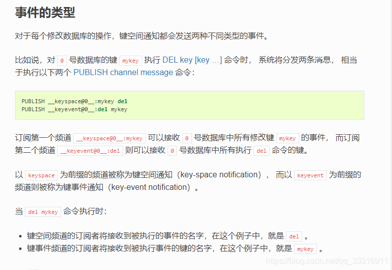
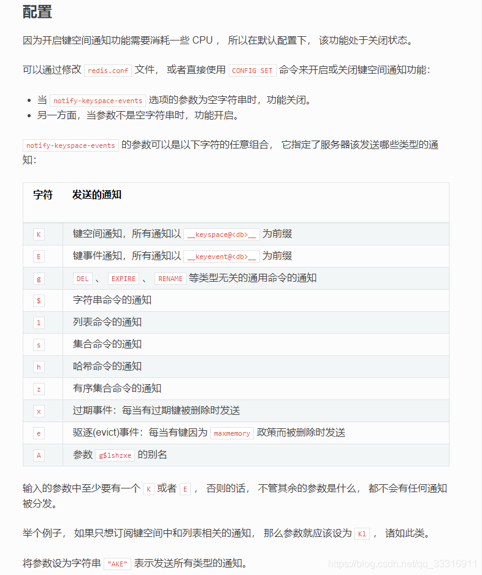
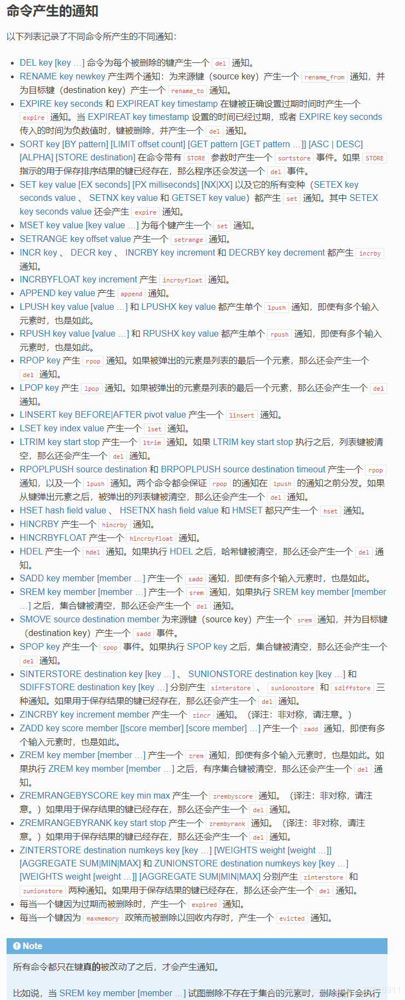

# C# 实现 Redis key过期通知客户端的监控事件

先描述一下标题的意思，在我们的日常开发需求中，举个比较常见的例子，订单过时未支付功能，例如抢票、秒杀，为了避免直接对数据库进行如此高并发的请求，在系统设计时候，会把这些数据放到消息队列或者Redis中，有些订单存在未支付，按照设计，超时了应该被取消。 这个需求用到的是Redis的订阅与发布功能 ，有关这个功能的链接点击[Redis订阅与发布功能介绍](http://redisdoc.com/topic/notification.html)，接下来给大家介绍一下实现的步骤。

```csharp
***注意：Redis版本必须为2.8.0以上才支持发布与订阅功能***
```

## **1. 事件类型与配置**



先介绍上面的几个参数，0表示redis数据库的下标，mykey表示某一个具体的键名称。上述的第一个频道可以监听具体热键被修改的动作，并返回被执行的事件的名称，第二个频道则可以监听任何键被删除的动作，并返回被删的键的名称，即mykey。因此，第一个频道返回事件名称del，第二个频道返回键名称mykey。

## 2. Redis配置

要了解一下Redis事件类型与配置，下图所示的“字符”，***输入的参数中至少要有一个 K 或者 E ， 否则的话， 不管其余的参数是什么， 都不会有任何通知被分发***，例如我们本次就会用到“Ex”组合，表示键过期通知事件，Redis配置

```csharp
notify-keyspace-events "Ex"
```



## **2. 所产生的具体通知类型（客户端实现）**

上述步骤中，任何正确的组合之后，不同命令或者操作都会产生不同的通知，下图有详细的解释。例如，删除一个key，就会触发一个del通知，插入一条数据时会产生set通知，每当一个键因为过期而被删除时，产生一个 expired 通知等等。



## 3. 实现步骤

了解了上述的两个目录内容之后，结合我们的需求，我们是要监听Redis所有key的过期事件，上图已经介绍，当某个key因为过期被删除时候，会产生一个expired通知，因此我们需要订阅的频道就是，首先是键事件，另外通知类型是expired，所以我们需要订阅的频道就是__keyevent@db_index__:expired

1. 更改Redis配置文件

```csharp
将 notify-keyspace-events "" 改为 notify-keyspace-events "Ex"
```

解释一下，notify-keyspace-events “” 表示没有发布任何订阅

1. C#端代码实现

```csharp
  var ret = ConnectionMultiplexer.Connect("127.0.0.1:6379,allowadmin=true");
  IDatabase database = ret.GetDatabase(0);
  ISubscriber subscriber = ret.GetSubscriber();
  subscriber.Subscribe("__keyevent@0__:expired", (channel, notificationType) =>
    {
      Console.WriteLine(channel + "|" + notificationType);
    });
 Console.ReadKey();
12345678
```

**

## 扩展知识

Redis 使用以下两种方式删除过期的键：

当一个键被访问时，程序会对这个键进行检查，如果键已经过期，那么该键将被删除。

底层系统会在后台渐进地查找并删除那些过期的键，从而处理那些已经过期、但是不会被访问到的键。

当过期键被以上两个程序的任意一个发现、 并且将键从数据库中删除时， Redis 会产生一个 expired 通知。

Redis 并不保证生存时间（TTL）变为 0 的键会立即被删除： 如果程序没有访问这个过期键， 或者带有生存时间的键非常多的话， 那么在键的生存时间变为 0 ， 直到键真正被删除这中间， 可能会有一段比较显著的时间间隔。

因此， Redis 产生 expired 通知的时间为过期键被删除的时候， 而不是键的生存时间变为 0 的时候。