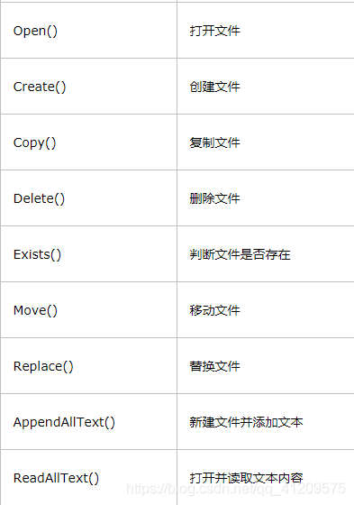

# C#中File和FileStream的用法

在近期的工作过程中发现自己的基础比较薄弱，所以最近在恶补基础知识。下面就对我所学习的File类和FileStream进行简单的总结。

**1.首先先介绍File类和FileStream文件流**

1.1 File类，是一个静态类，支持对文件的基本操作，包括创建，拷贝，移动，删除和打开一个文件。File类方法的参量很多时候都是路径path。主要提供有关文件的各种操作，在使用时需要引用System.IO命名空间。

 1.2 FileStream文件流 只能处理原始字节(raw byte)。FileStream 类可以用于任何数据文件，而不仅仅是文本文件。FileStream 对象可以用于读取诸如图像和声音的文件，FileStream读取出来的是字节数组，然后通过编码转换将字节数组转换成字符串。

1.3 区别：file:是一个文件的类,对文件进行操作的；filestream:文件流.对txt,xml等文件写入内容的时候需要使用的一个工具.打个形象的比喻.file是笔记本,需要filestream的这个笔才能写.

**2.代码部分**


```c#
2.1 File类创建Txt
1. string path = @"C:\Users\Administrator\Desktop\1.txt";
2. File.Open(path, FileMode.OpenOrCreate);
2.2 File类Txt拼接内容

1. List<string> users = new List<string>();
2. users.Add("张三|1000");
3. users.Add("李四|10000");
4. users.Add("王五|5000");
5. users.Add("赵六|6000");
6. File.AppendAllLines(path, users, Encoding.Default);
2.3  File类字节形式读取txt文档

1. byte[] buttf = File.ReadAllBytes(path);
2. string str = Encoding.Default.GetString(buttf, 0, buttf.Length);
2.4 File类实现txt员工工资加倍

1. string[] filestr = File.ReadAllLines(path, Encoding.Default);
2. for (int i = 0; i < filestr.Length; i++)
3. {
4. string[] str = filestr[i].Split('|');
5. filestr[i] = str[0] + "|" + (Convert.ToDouble(str[1]) * 2).ToString();
6. }
7. File.AppendAllLines(path, filestr, Encoding.Default);
2.5 File类常用方法 
```

</img>

```c#
3.文件流
3.1文件流文字形式读取

1. byte[] bytsize = new byte[1024 * 1024 * 5];
2. using (FileStream stream = new FileStream(path, FileMode.OpenOrCreate,FileAccess.ReadWrite))
3. {
4. while (true)
5. {
6. int r = stream.Read(bytsize, 0, bytsize.Length);
7. //如果读取到的字节数为0，说明已到达文件结尾，则退出while循
8. if (r == 0)
9. {
10. break;
11. }
12. string str = Encoding.Default.GetString(bytsize, 0, r);
13. Console.WriteLine(str);
14. }
15. }
3.2文件流文字形式写入

1. string str = "今天天气好晴朗，处处好风光";
2. byte[] buttf = Encoding.Default.GetBytes(str);
3. //文件流的写入
4. using (FileStream fscreat = new FileStream(path, FileMode.Append, FileAccess.Write))
5. {
6. fscreat.Write(buttf, 0, buttf.Length);
7. }
3.3文件流视频形式复制

1. byte[] bytsize = new byte[1024 * 1024 * 5];       
2. string videoPath = @"C:\Users\Administrator\Desktop\1、练习1-3.avi";
3. string videoNewPath = @"C:\Users\Administrator\Desktop\1.avi";
4. //创建读取流
5. using (FileStream fsread=new FileStream(videoPath,FileMode.Open,FileAccess.Read))
6. {
7. //创建写入流
8. using (FileStream fswrite=new FileStream(videoNewPath,FileMode.OpenOrCreate,FileAccess.Write))
9. {
10. while (true)
11. {
12. //返回实际读取到的字节
13. int r = fsread.Read(bytsize, 0, bytsize.Length);
14. //当字节位0的时候 证明已经读取结束
15. if(r==0){
16. break;
17. }
18. fswrite.Write(bytsize,0,r);
19. }
20. }
21. }

```

