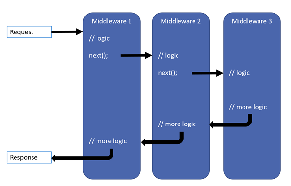

# 过滤器和中间件

##### 中间件（Middleware）的作用

我们知道，任何的一个web框架都是把http请求封装成一个管道，每一次的请求都是经过管道的一系列操作，最终到达我们写的代码中。那么中间件就是在应用程序管道中的一个组件，用来拦截请求过程进行一些其他处理和响应。中间件可以有很多个，每一个中间件都可以对管道中的请求进行拦截，它可以决定是否将请求转移给下一个中间件。

asp.net core 提供了`IApplicationBuilder`接口来让把中间件注册到asp.net的管道请求当中去，中间件是一个典型的AOP应用。 下面是一个微软官方的一个中间件管道请求图：

可以看到，每一个中间件都都可以在请求之前和之后进行操作。请求处理完成之后传递给下一个请求。

##### 中间件的运行方式

默认情况下，中间件的执行顺序根据`Startup.cs`文件中，在`public void Configure(IApplicationBuilder app){}` 方法中注册的先后顺序执行。
大概有3种方式可以在管道中注册"中间件"

1. `app.Use()`，`IApplicationBuilder`接口原生提供，注册等都用它。
2. `app.Run()` ，是一个扩展方法，它需要一个`RequestDelegate`委托，里面包含了Http的上下文信息，没有next参数，因为它总是在管道最后一步执行。
3. `app.Map()`，也是一个扩展方法，类似于MVC的路由，用途一般是一些特殊请求路径的处理。如：www.example.com/token 等。

上面的Run，Map内部也是调用的Use，算是对IApplicationBuilder接口扩充，如果你觉得名字都不够准确，那么下面这个扩展方法就是正宗的注册中间件的了，也是功能最强大的。
`app.UseMiddleware<>()`，没错，就是这个了。 为什么说功能强大呢？是因为它不但提供了注册中间件的功能，还提供了依赖注入（DI）的功能，以后大部分情况就用它了。

##### 中间件（Middleware）和过滤器（Filter）的区别

熟悉MVC框架的同学应该知道，MVC也提供了5大过滤器供我们用来处理请求前后需要执行的代码。分别是`AuthenticationFilter`,`AuthorizationFilter`,`ActionFilter`,`ExceptionFilter`,`ResultFilter`。

根据描述，可以看出中间件和过滤器的功能类似，那么他们有什么区别？为什么又要搞一个中间件呢？
其实，过滤器和中间件他们的关注点是不一样的，也就是说职责不一样，干的事情就不一样。

同作为两个AOP利器，过滤器更贴合业务，它关注于应用程序本身，比如你看`ActionFilter` 和 `ResultFilter`，它都直接和你的Action，ActionResult交互了，是不是离你很近的感觉，那我有一些比如对我的输出结果进行格式化啦，对我的请求的ViewModel进行数据验证啦，肯定就是用Filter无疑了。它是MVC的一部分，它可以拦截到你Action上下文的一些信息，而中间件是没有这个能力的。

##### 什么情况我们需要中间件

那么，何时使用中间件呢？我的理解是在我们的应用程序当中和业务关系不大的一些需要在管道中做的事情可以使用，比如身份验证，Session存储，日志记录等。其实我们的 asp.net core项目中本身已经包含了很多个中间件。