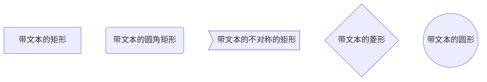
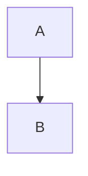
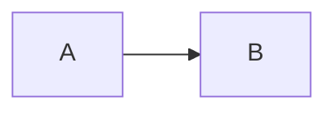
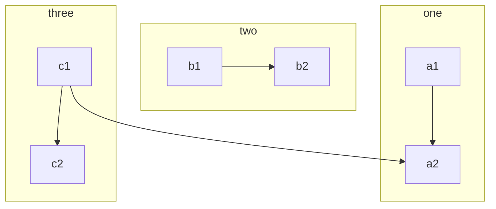
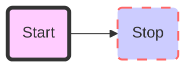
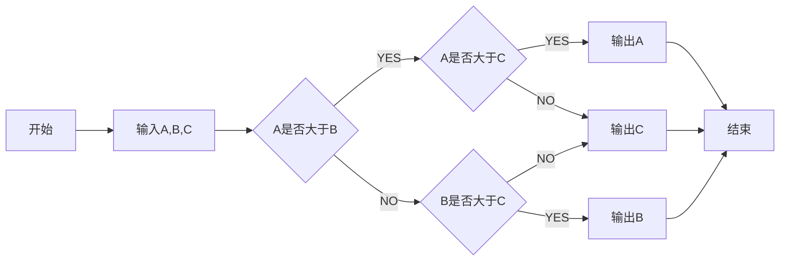

```mermaid
graph TD
    id[带文本的矩形]
    id4(带文本的圆角矩形)
    id3>带文本的不对称的矩形]
    id1{带文本的菱形}
    id2((带文本的圆形))
```

#### 流程图方向
* TB 从上到下
* BT 从下到上
* RL 从右到左
* LR 从左到右
* TD 同TB

##### 示例
>>从上到下

```mermaid
graph TD
 A --> B
```

>> 从左到右

```mermaid
graph LR
    A --> B
```

```mermaid
graph TB
    c1-->a2
    subgraph one
    a1-->a2
    end
    subgraph two
    b1-->b2
    end
    subgraph three
    c1-->c2
    end
```

```mermaid
graph LR
    id1(Start)-->id2(Stop)
    style id1 fill:#f9f,stroke:#333,stroke-width:4px,fill-opacity:0.5
    style id2 fill:#ccf,stroke:#f66,stroke-width:2px,stroke-dasharray: 10,5
```

```mermaid
graph LR
    start[开始] --> input[输入A,B,C]
    input --> conditionA{A是否大于B}
    conditionA -- YES --> conditionC{A是否大于C}
    conditionA -- NO --> conditionB{B是否大于C}
    conditionC -- YES --> printA[输出A]
    conditionC -- NO --> printC[输出C]
    conditionB -- YES --> printB[输出B]
    conditionB -- NO --> printC[输出C]
    printA --> stop[结束]
    printC --> stop
    printB --> stop
```