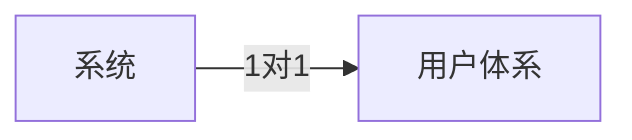
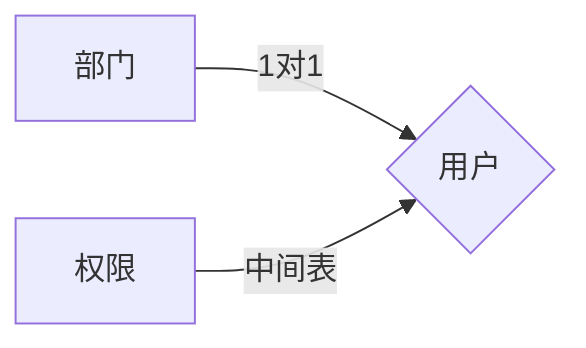
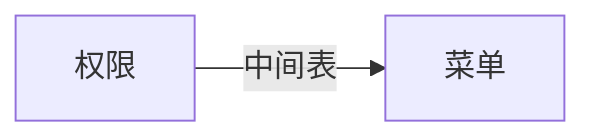
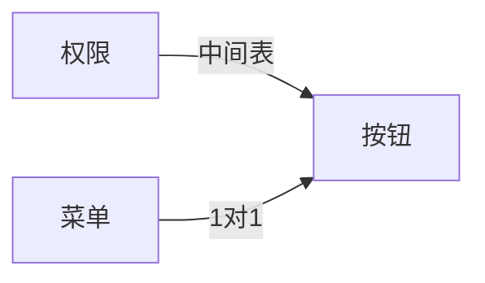

# 中台系统

### 1.什么是中台系统

中台系统是通用的各个子系统用户账号权限菜单的管理系统。

可以创建新系统。创建系统是生成一个系统token登录的时候用该系统token或者id（唯一就行）和账号密码登录

### 2. 为什么要使用中台系统

与中台系统对应的是独立部署的系统。独立部署的系统包括用户模块和业务模块

好处是可以轻松拿到用户表所有数据。只有业务模块的通过中台系统可以拿到中台系统给的token里的用户数据。好处是用户模块通用，维护方便。一般情况下token里的数据是够用的。

### 用户体系

