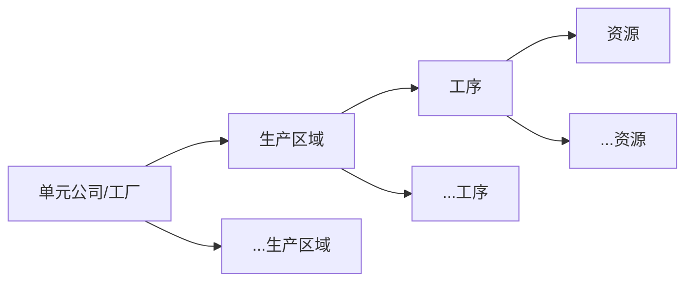
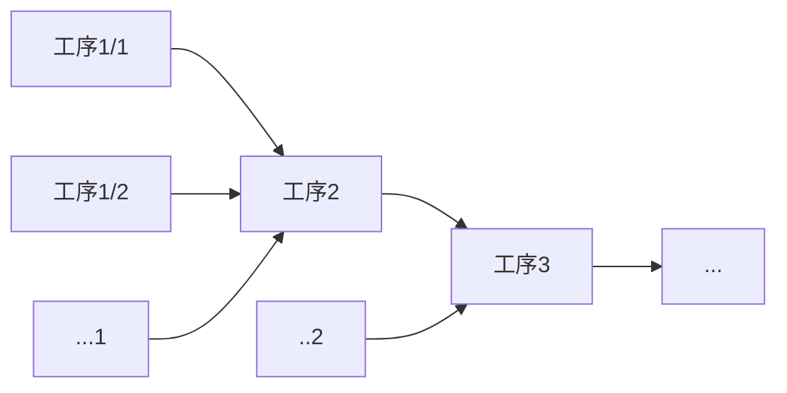
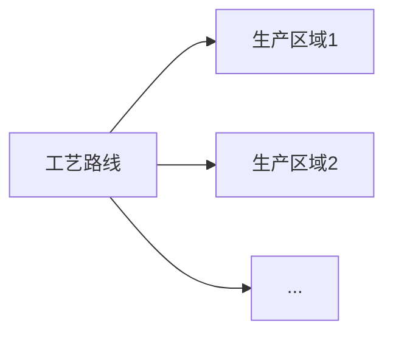
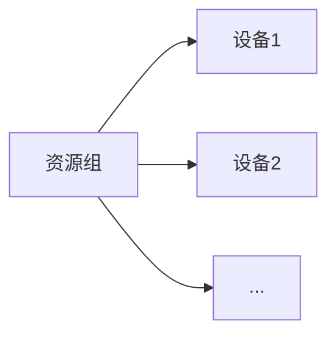
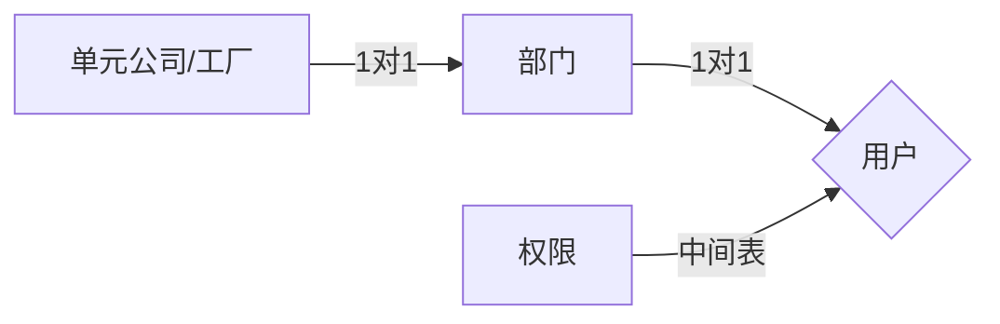
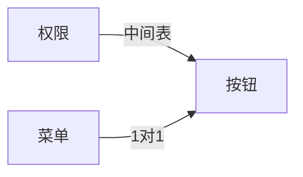
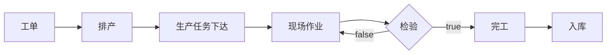
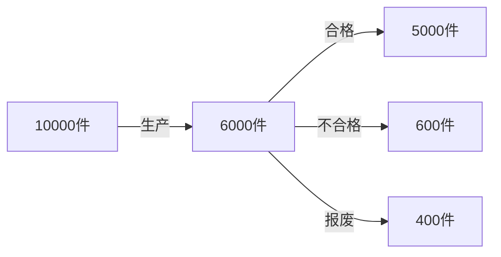
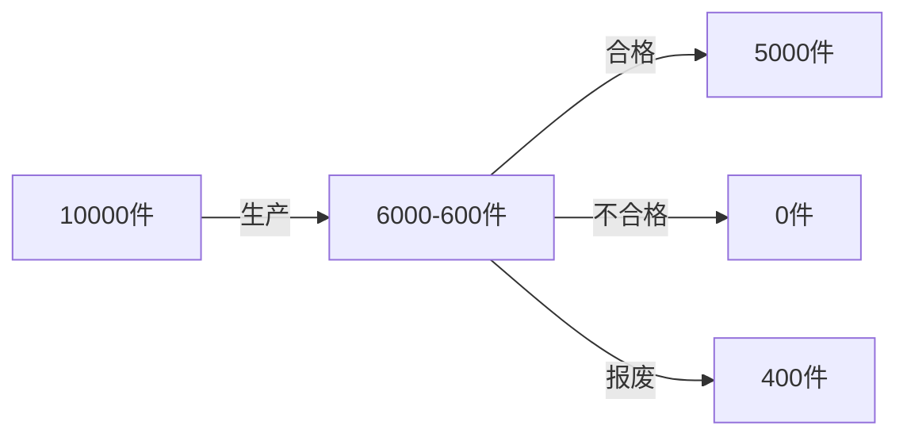
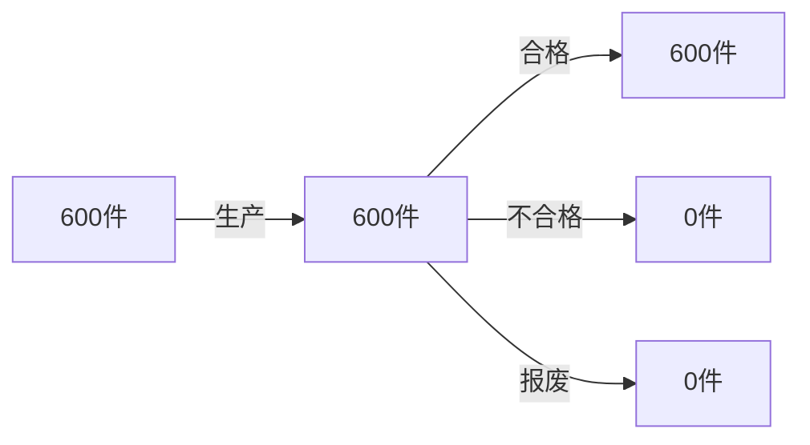

# 工厂生产逻辑
### 基础数据

### 生产流程图

* 单元公司：一个公司下面的不同工厂
* 生产区域：拓普叫产线。单元公司下面不同的生产区域生产不同的东西
* 工序：生产区域下的一个工序（工序和生产区域没有直接关系）
* 资源：拓普叫工位。人工或者机器都叫资源。和工序没有直接关系。
* 工艺路线：生产区域集合
* 资源组：资源的打包关联工序

### 用户权限结构

### 生产流程

#### 工单

>* 需要生产的物料item_code
>* 需要的数量
>* 生产订单编号（工单和订单表分开订单表存客户信息业务员等和生产无关的信息工单表存itemcode）

#### 排产

>* 根据工单物料选择对应工艺路线
>* 根据工艺路线选择对应设备
>* 排产分班组每个班组生产效率不同
>* 设备有节拍属性

#### 生产任务下达

>* 根据生产批给对应设备添加一条生产任务
>* 生产任务有待生产生产中已完成的状态

#### 现场作业

>* 生产准备
>
>  >人（上下机）
>  >
>  >机（设备点检）*设备是否正常使用
>  >
>  >模（上下模）*模具有损耗到一定成都要换模具
>  >
>  >料（投料）
>  >
>  >法（SIP SOP）*就是生产流程一个视频
>
>* 生产执行
>
>  >进站报工（开始生产）
>  >
>  >过程管理（设备稼动，安灯）*安灯是如果设备坏了提醒维修人员来修理
>  >
>  >出站报工（结束生产）

#### 检验

>* 首检（第一件）
>* 巡检（定时检验）
>* 末检（最后一件）

#### 不合格600件重新生产就会变成一个新的生产批关连父生成批变成

#### 质检员进行重新排产

#### 生产批是一个无限循环的bom

### 轻量化mes全局过滤逻辑

后端在userinfo接口会给前端一个is_super_admin字段

true是超级管理员。他的选择工厂下拉就没有限制当他选择对应工厂的时候在请求头加上factory:对应工厂的code

false不是超级管理员。后端在userinfo接口会给前端一个factory_code。前端在请求头加上这个factory_code

#### 示例

