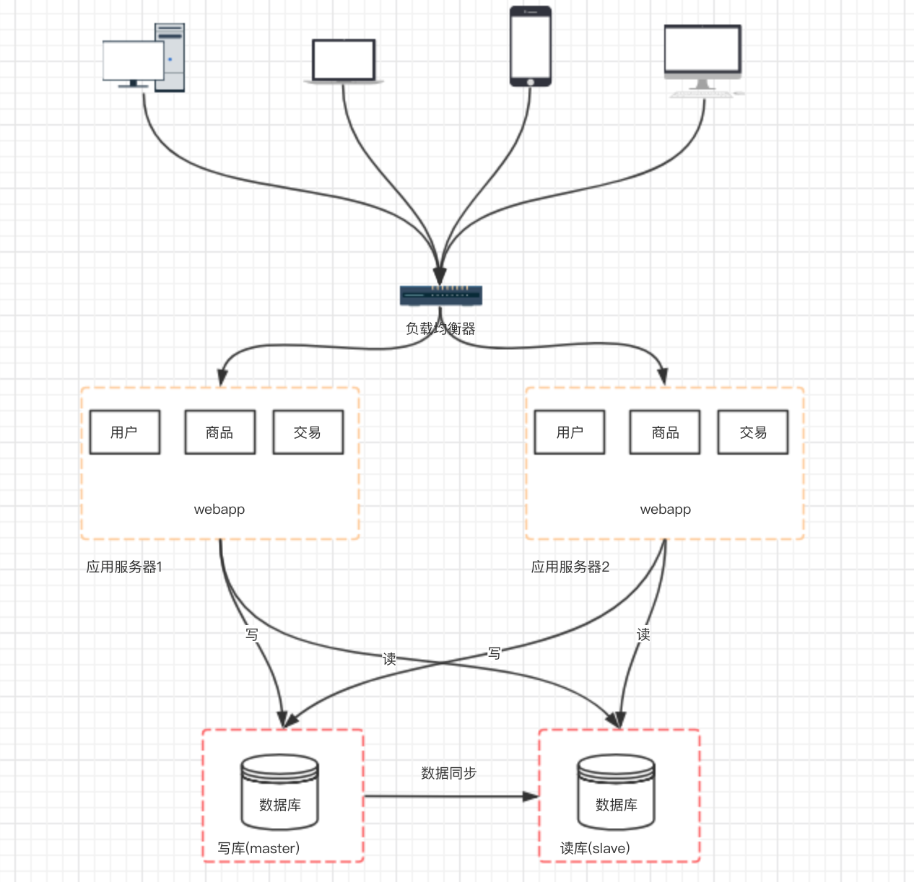
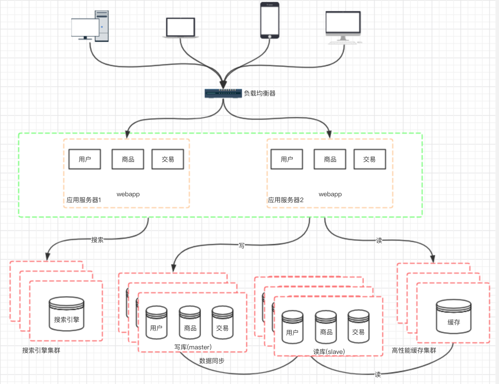
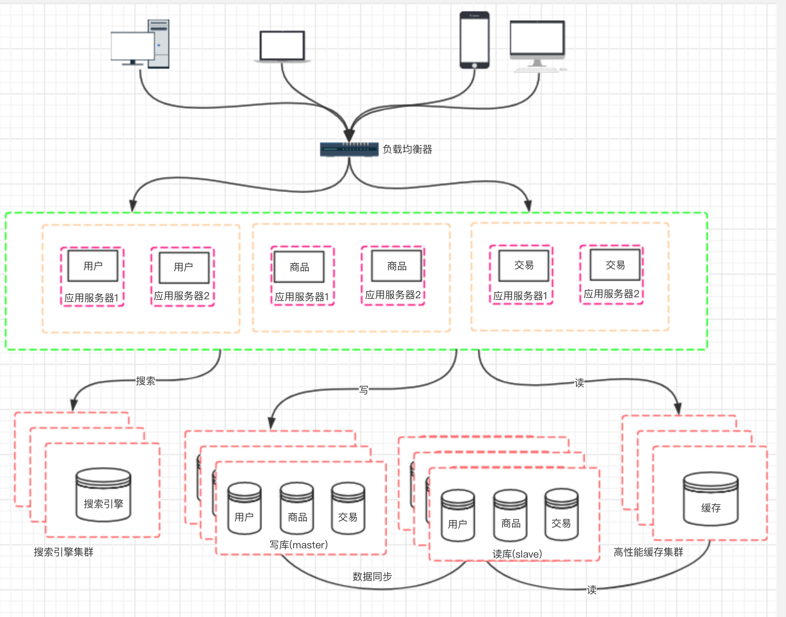

# 分布式架构的总结

**一、前言**

　　随着社会的发展，技术的进步，以前的大型机架构很显然由于高成本、难维护等原因渐渐地变得不再那么主流了，替代它的就是当下最火的分布式架构，从大型机到分布式，经历了好几个阶段，我们弄明白各个阶段的架构，才能更好地理解和体会分布式架构的好处，那么本文我们就来聊聊分布式架构的演进过程，希望能给大家带来眼前一亮的感觉。

**二、背景说明**

　　我们都知道一个成熟的大型网站的系统架构并非一开始就设计的非常完美，也没有一开始就具备高性能、高并发、高可用、安全性等特性，而是随着用户量的增加、业务功能的扩展逐步演变过来的，慢慢的完善的。 在这个过程中，开发模式、技术架构等都会随着迭代发生非常大的变化。 而针对不同业务特征的系统，各自都会有自己的侧重点，例如像淘宝这类的网站，要解决的重点问题就是海量商品搜索、下单、支付等问题; 像腾讯这类的网站，要解决的是数亿级别用户的实时消息传输;而像百度这类的公司所要解决的又是海量数据的搜索。每一个种类的业务都有自己不同的系统架构。

　　下面我们来简单模拟一个架构演变过程。 我们以 javaweb 为例，来搭建一个简单的电商系统，从这个系统中来看系统的演变过程。要注意的是接下来的演示模型， 关注的是数据量、访问量提升，网站结构的变化， 而不关注具体业务的功能点。其次，这个过程是为了让大家能更好的了解网站演进过程中的一些问题和应对策略。

假如我们系统具备以下功能:

- 用户模块:用户注册和管理。
- 商品模块:商品展示和管理。
- 交易模块:创建交易及支付结算。

**三、阶段一：单应用架构**

这个阶段是网站的初期，也可以认为是互联网发展的早期，系统架构如上图所示。我们经常会在单台服务器上运行我们所有的程序和软件。 把所有软件和应用都部署在一台机器上，这样就完成一个简单系统的搭建，这个阶段的讲究的是效率。效率决定生死。

**四、阶段二：应用服务器和数据库服务器分离**

　　随着网站的上线，访问量逐步上升，服务器的负载慢慢提高，我们应该在服务器还没有超载的时候就做好规划、提升网站的负载能力。假若此时已经没办法在代码层面继续优化提高，那么在单台机器的性能遇到瓶颈的时候，增加机器是一个比较简单好用的方式，投入产出比相当高。这个阶段增加机器的主要目的是将 web 服务器和 数据库服务器拆分开来，这样做的话不仅提高了单机的负载能力，也提高了整个系统的容灾能力。

这个阶段的系统架构如上图所示，应用服务器和数据库服务器完全隔离开来，相互互不影响，大大减少了网站宕机的风险，此阶段我们已经开始关注到应用服务器的管理了。

**五、阶段三：应用服务器集群**

　　这个阶段，随着访问量的继续不断增加，单台应用服务器已经无法满足我们的需求。 假设我的数据库服务器还没有遇到性能问题，那我们可以通过增加应用服务器的方式来将应用服务器集群化，这样就可以将用户请求分流到各个服务器中，从而达到继续提升系统负载能力的目的。此时各个应用服务器之间没有直接的交互，他们都是依赖数据库各自对外提供服务。

系统架构发展到这个阶段，各种问题也会接踵而至：

- 用户请求交由谁来转发到具体的应用服务器上(谁来负责负载均衡)
- 用户如果每次访问到的服务器不一样，那么如何维护
            session，达到session共享的目的。

那么此时，系统架构又会变成如下方式：
负载均衡又可以分为软负载和硬负载。软负载我们可以选择Nginx、Apache等，硬负载我们可以选择F5等。而session共享问题我们可以通过配置tomcat的session共享解决。

**六、阶段四：数据库压力变大，数据库读写分离**

架构演变到上面的阶段，并不是终点。通过上面的设计，应用层的性能被我们拉上来了， 但数据库的负载也在逐渐增大，那如何去提高数据库层面的性能呢？有了前面的设计思路以后，我们自然也会想到通过增加服务器来提高性能。但假如我们单纯的把数据库一分为二，然后对于数据库的请求，分别负载到两台数据库服务器上，那必定会造成数据库数据不统一的问题。 所以我们一般先考虑将数据库读写分离。

这个架构设计的变化会带来如下几个问题：

- 主从数据库之间的数据需要同步(可以使用     mysql 自带的 master-slave 方式实现主从复制 )
- 应用中需要根据业务进行对应数据源的选择(     采用第三方数据库中间件，例如 mycat )

**七、阶段五：使用搜索引擎缓解读库的压力**

　　我们都知道数据库常常对模糊查找效率不是很高，像电商类的网站，搜索是非常核心的功能，即使是做了读写分离，这个问题也不能得到有效解决。那么这个时候我们就需要引入搜索引擎了，使用搜索引擎能够大大提升我们系统的查询速度，但同时也会带来一 些附加的问题，比如维护索引的构建、数据同步到搜索引擎等。**八、阶段六：引入缓存机制缓解数据库的压力**

　　然后，随着访问量的持续不断增加，逐渐会出现许多用户访问同一内容的情况，那么对于这些热点数据，没必要每次都从数据库重读取，这时我们可以使用到缓存技术，比如 redis、memcache 来作为我们应用层的缓存。另外在某些场景下，如我们对用户的某些 IP 的访问频率做限制， 那这个放内存中就又不合适，放数据库又太麻烦了，那这个时候可以使用 Nosql 的方式比如 mongDB 来代替传统的关系型数据库。**九、阶段七：数据库的水平/垂直拆分**

我们的网站演进的变化过程，交易、商品、用户的数据都还在同一 个数据库中，尽管采取了增加缓存，读写分离的方式，但是随着数 据库的压力持续增加，数据库的瓶颈仍然是个最大的问题。因此我 们可以考虑对数据的垂直拆分和水平拆分。垂直拆分:把数据库中不同业务数据拆分到不同的数据库。

水平拆分:把同一个表中的数据拆分到两个甚至更多的数据库中，水平拆分的原因是某些业务数据量已经达到了单个数据库的瓶颈，这时可以采取将表拆分到多个数据库中。**十、阶段八：应用的拆分**

随着业务的发展，业务量越来越大，应用的压力越来越大。工程规模也越来越庞大。这个时候就可以考虑将应用拆分，按照领域模型将我们的用户、商品、交易拆分成多个子系统。
这样拆分以后，可能会有一些相同的代码，比如用户操作，在商品和交易都需要查询，所以会导致每个系统都会有用户查询访问相关操作。这些相同的操作一定是要抽象出来，否则就是一个坑。所以通过走服务化路线的方式来解决。

那么服务拆分以后，各个服务之间如何进行远程通信呢? 通过 RPC 技术，比较典型的有:dubbo、webservice、hessian、http、RMI 等等。前期通过这些技术能够很好的解决各个服务之间通信问题，但是， 互联网的发展是持续的，所以架构的演变和优化也还在持续。

**十一、总结**

通过本文，我们通过一个电商的案例，就了解到了分布式架构的演进过程，一环套一环，环环紧密相扣。都是通过业务量和访问量的提升来考虑重构架构设计，以便能够适应当前的环境。不可一蹴而就，也急不来，初创企业必须稳扎稳打，一步一个脚印的走出一条专属自己的路。加油，everybody！